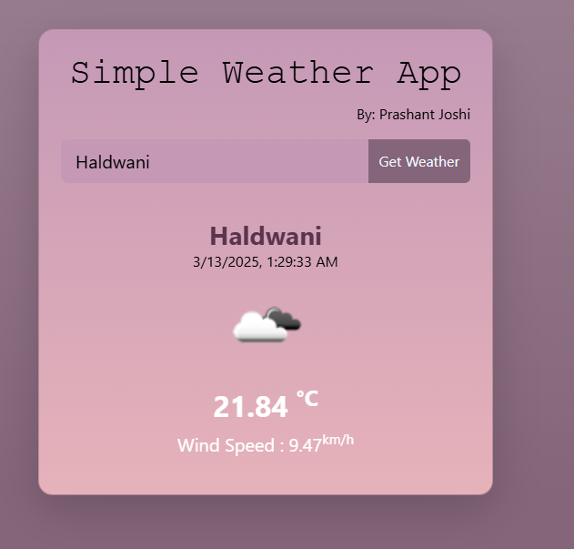

# 🌦️ Weather App

A simple **Weather App** that provides real-time weather updates using the **OpenWeather API**. Built with **JavaScript, Tailwind CSS, and asynchronous API handling**, this app allows users to fetch weather details of any location instantly.

## 🚀 Features
✅ **Real-time weather data** powered by the [OpenWeather API](https://openweathermap.org/api)  
✅ **Search for any city** and get instant weather details  
✅ **Dynamic background changes** based on weather conditions  
✅ **Responsive UI** with **Tailwind CSS** for a clean and modern look  
✅ **Error handling** for invalid locations and API failures  

## 📸 Screenshots


## 🛠️ Technologies Used
- **HTML, CSS (Tailwind CSS)**  
- **JavaScript (ES6+)**  
- **OpenWeather API** (for real-time weather data)  

## 🔧 Installation & Setup

1️⃣ **Clone the repository:**
```bash
git clone https://github.com/your-username/weather-app.git
cd weather-app
```

2️⃣ **Get an API Key from OpenWeather:**
- Sign up at [OpenWeather](https://openweathermap.org/) and get your API key.
- Replace `YOUR_API_KEY` in the JavaScript file with your actual key.

3️⃣ **Open the project in a browser:**
Just open `index.html` in your browser—no extra setup needed!

## 🎯 How It Works
1. **Enter a city name** in the search bar.
2. **Click "Get Weather"** to fetch the latest weather data.
3. **View temperature, humidity, and weather conditions** for the selected city.
4. **Background changes dynamically** based on weather (e.g., sunny, rainy, snowy).

## ⚡ Challenges & Learnings
### **🔹 Challenges:**
❌ Handling API errors and invalid city names  
❌ Implementing dynamic UI updates based on weather  
❌ Optimizing API requests to avoid rate limits  

### **💡 Learnings:**
✅ **Working with external APIs** and handling asynchronous data  
✅ **Error handling in JavaScript** for better user experience  
✅ **Tailwind CSS for responsive UI design**  
✅ **Using local storage** to save recent searches  

## 🌟 Contributing
Want to improve this project? Feel free to fork and submit a PR! Contributions are always welcome.

## 📜 License
This project is open-source under the **MIT License**.

---

### 🔗 **Connect With Me**
💼 **LinkedIn:** [My Profile]([https://linkedin.com/in/your-profile](https://www.linkedin.com/in/iamprashu/))  
🐙 **GitHub:** [My GitHub](https://github.com/iamprashu)  
